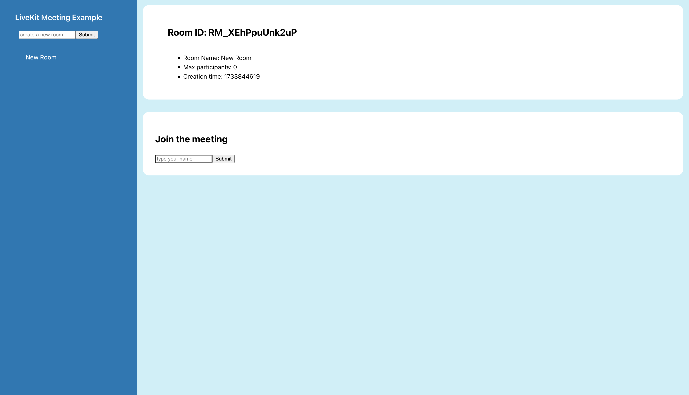
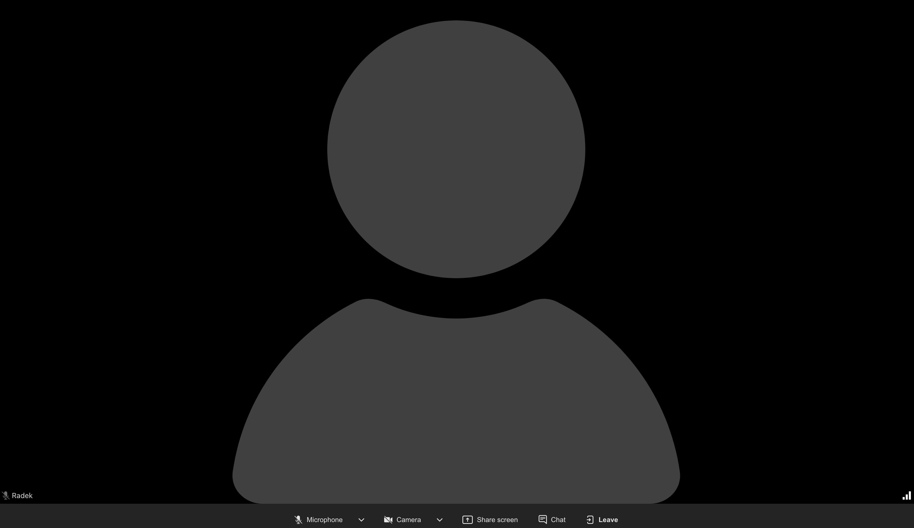

# LiveKit Meet Demo 

This project integrates simple flow provided by LiveKit implementing a Video conference capabalities. It uses a Gokang Server SDK on 
the server and React/Typescript ecosystem on the frontend.

## Deployed Version

The deployed links related to this project are the following:

- Frontend application: [https://meet.digitalfun.space](https://meet.digitalfun.space)
- Server API: [https://api.digitalfun.space](https://api.digitalfun.space)

## Preview

### Empty project

### Room Detail Screen

### Video Call

## Tech Stack

The core technologies and libraries used in this project include:

### Frontend App
 
- **[ReactJS 18](https://react.dev)** - A popular frontend library maintained by Meta, designed for building user interfaces.
- **[TypeScript](https://www.typescriptlang.org)** - A typed superset of JavaScript, improving code maintainability and reliability.
- **[Tanstack Query](https://tanstack.com/query/latest)** - A robust toolset for managing and simplifying HTTP requests in React applications.
- **[React Hook Form](https://react-hook-form.com)** - Performant, flexible and extensible forms with easy-to-use validation.
- **[Axios](https://github.com/axios/axios)** - A flexible and feature-rich library for making HTTP calls.
- **[Zod](https://zod.dev)** - A schema validation library used for verifying the shape and structure of HTTP responses.
- **[Vite](https://vite.dev)** - A fast and lightweight JavaScript bundler that ties the project components together.
  **[LiveKit UI Tools](https://docs.livekit.io/agents/openai/client-apps)** - There are [@livekit/components-react](https://www.npmjs.com/package/@livekit/components-react)
  and [@livekit/components-styles](https://www.npmjs.com/package/@livekit/components-styles) packages used in this project.

### Backend API

- **[Golang](https://go.dev)** - An open-source programming language supported by Google.
- **[LiveKit Golang SDK](https://github.com/livekit/server-sdk-go)** - LiveKit SDK for the Golang specific language.
- **[httprouter](https://github.com/julienschmidt/httprouter)** - HttpRouter is a lightweight high performance HTTP request router for Go.
- **[cors](https://github.com/rs/cors)** - A package helping with settings of the CORS rules.

## Key Highlights

This section quickly summarizes the important bits for the testing purposes:

### Environment Overview

- The application is split into two services: the [API service](./api-service) and the [Web Client](./web-client). 
  They are implemented in **Golang** and **TypeScript**, following modern best practices and principles.
- The system is deployed and accessible via [https://meet.digitalfun.space](https://digitalfun.space), with the API 
  running at [https://api.digitalfun.space](https://api.digitalfun.space).
- The production environment is hosted on a [DigitalOcean Droplet](https://www.digitalocean.com/products/droplets), with [Caddy](https://caddyserver.com/) used as a 
  reverse proxy for its efficiency and ease of setup.

### Testing Use Cases

- The app uses [Rooms Service Client](https://docs.livekit.io/home/server/managing-rooms) to create and list 
  available rooms.
- If you [the app](https://digitalfun.space), you can easily create a new room that will be valid for a short period 
  of time.
- Once the room is created, you can click on the detail of that resource that will show some basics metadata.
- Most importantly, you can create your alias and join a meeting session.
- A basic exit callback is implemented, therefore after the call is done, the app redirects to the `/rooms` list.
- The auth token authorizing the meeting sessions are implemented with the help of [Token Generation API](https://docs.livekit.io/home/server/generating-tokens).

## Implementation decisions and learning from it

I'm personally comfortable with JavaScript and TypeScript ecosystem on the frontend and backend. However, for this 
project I decided to go with [Go programming language](https://go.dev) for the server part as I wanted to get more 
comfortable with non-JS ecosystem.

The implementation was very straightforward. I started with the integration of the [Rooms Service Client]
(https://docs.livekit.io/home/server/managing-rooms) and had first two endpoints ready relatively quickly.

It took me a bit longer to study the details how to properly integrate the [Token Generation API](https://docs.
livekit.io/home/server/generating-tokens), what is the relation between the **LiveKit websocket resource** and the 
**hosted infrastructure**, but once understood the flow, the rest of the implementation process was relatively seamless.

On the frontend side, I used the modern React stack with [@livekit/components-react](https://www.npmjs.com/package/@livekit/components-react) to quickly prototype a single page app that is able to 
utilize the API described above. 

One thing was the absence of the initial styles during a meeting sessions. Fortunately, I found this styling library: 
[@livekit/components-styles](https://www.npmjs.com/package/@livekit/components-styles) and the meeting turned into a 
much nicer experience.
 
I didn't include any database solution/file storage for permanently storing the data as this is just a simple 
example, but I would be keen on digging deeper in potential future iterations.

## Running the Application Locally

To set up and run the applications locally, please refer to the guidelines in the respective directories:

- [api-service](./api-service) - Detailed instructions for setting up the backend **Golang** service.
- [web-client](./web-client) - Detailed instructions for setting up the frontend **React** application.

Each directory contains a `README.md` file with the necessary steps to get the respective service up and running on your local machine.

## Conclusion

The project was a fun way how to learn more about LiveKit capabilities. Despite the fact the project just scratch 
the surface and uses a very simple flow for a specific use-case, I was still able to learn a lot.    

If you have any questions about the code or need further clarification, feel free to reach out to me at
[radek.tomasek@gmail.com](radek.tomasek@gmail.com). I'd be more than happy to assist.
